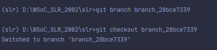
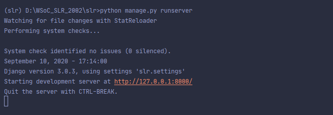
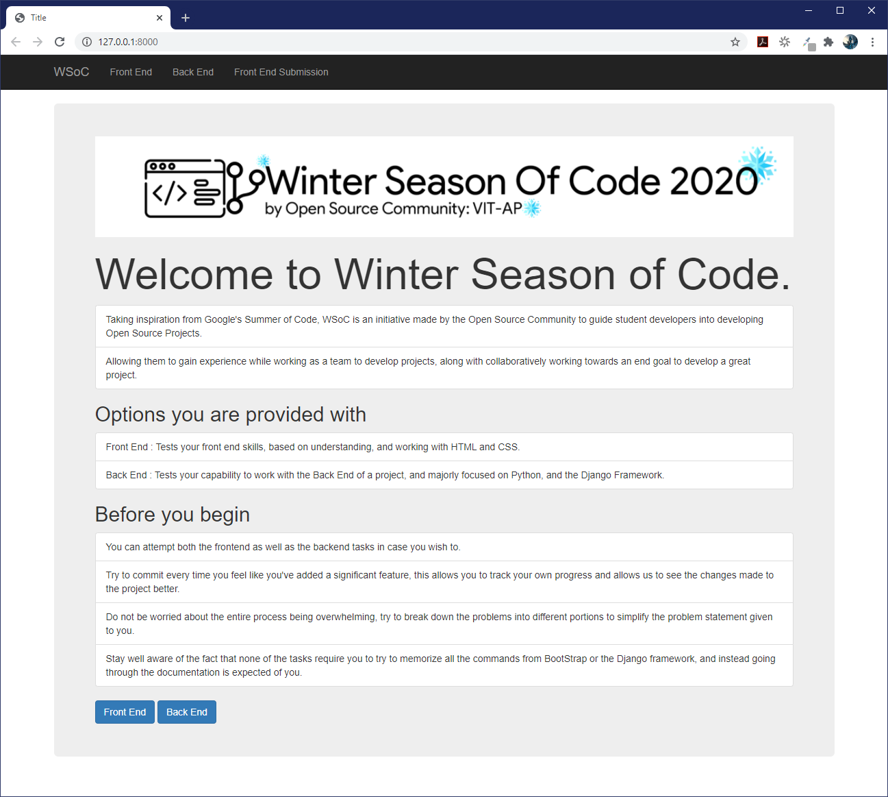

<p align="center">
    
</p>

# Winter Season of Code SLR
Welcome to WSoC, an initiative by the Open Source Community at VIT-AP.\
In case, you wish to learn more about WSoC, please redirect yourself to the [website](https://www.wsocbyosc.com).

## Details on how to apply for shortlisting
  - Clone the Repository to your local system.
  - Create a new child branch to work on, separate from the master branch.
  - The branch must follow a particular naming convention - *branch_registrationno*, example : **branch_28bce7339**, so that it becomes easier for us in processing your application.
  - You can work on either the frontend or the backend challenges, depending on whichever area you wish to focus on.
  - After finishing any task, commit, and push, to the branch that you've created.
  - Upon completion of all the tasks, send a pull request in order to merge your branch onto the master branch signifying your submission.

## Project prerequisites
### Front End
 - Basic knowledge of HTML, and CSS
 - Beginner level knowledge of Python

### Back End
 - Intermediate level knowledge of Python
 
 **Kindly Note:** You can choose either of these options. If you wish to, you can work on both as well.

## Resources for setting up the Workspace
### Cloning and branching the project onto your local system

Remember that you must already have [git](https://git-scm.com/downloads) pre-installed in your system, in order to use it for the process of cloning the repository into your local computer.

In order to clone the repository after you install and set up git on your device, you should execute the following command as given below.

```shell
git clone https://github.com/Open-Source-Community-VIT-AP/WSoC-TestRepo1.git
```
This clones the repository into whichever directory in the system that you want the project to reside in.
Now, in order to create your own branch using git, you can use the following command. 
```shell
git branch your-branch-name
```
Replace your branch name in place of "your-branch-name" in the above command.
For example:
```shell
git branch branch_28bce7339
```

This creates your new branch, which is named **branch_28bce7339**.
In order to switch to your new branch, you must use the following command.

```shell
git checkout your-branch-name
```
<p align="center">
    
</p>

This switches to your new branch, and you can now start working on the repository, on your personal branch.

### Setting up the Django Ecosystem

Remember that you must have python, and pip installed in your local computer before you can install Django.

The below command automatically installs all the components required for basic Django usage, using the pip package manager.

```shell
python -m pip install django 
```

Now you should have the django components installed into your system and you should be good to move on to the new step.

This is an intro for people who use the default package manager, i.e. pip.
If you use any other kind of package manager, look into their documentation in order to install Django.

### Running the server to begin working on the test repo

In order to run the django server, you go into the directory where the python file manage.py resides.
This program acts as a gateway for many of the django related commands and is very essential for running the server, making migrations, and testing the website.

The below command is to be executed after you have directed yourself into the specific directory where the manage.py file resides.

```shell
python manage.py runserver
```

If everything has been done and installed correctly, the above given command should give you an output like this.

<p align="center">
    
</p>

This means that you are able to run the server.
In the end, you should see a screen like this, after opening up the local server on any web browser.

<p align="center">
    
</p>

## What next?

There exist two deadlines for submission.\
**September 25th.** For the early birds.\
**October 10th.** For the perfectionists.\
(The earlier, the better 😄)

If you've done your best with the branch and have sent it in for merging already, you're on the right track.\
Don't worry about the results, take a break.

We'll contact you if you're in. 😉
